# Feature guide

This guide walks through everything database-backup-utility does today, in the
order an operator meets it: sign in, register databases, back them up, restore
them, prove the backups restore, and then automate all of it. Every screenshot
and animation below was recorded from a real run of the application against
all seven supported engines. [How the tour was recorded](#how-this-tour-was-recorded)
explains the setup.

The tool does one job: **full logical backups and same-engine restores**,
driven from a small web console, an HTTP API or a CLI. It does not take
physical backups, build incremental chains, replay logs or restore to a point
in time, and it never converts between engines.

## Contents

1. [At a glance](#at-a-glance)
2. [Signing in](#1-signing-in)
3. [Backup targets](#2-backup-targets)
4. [Running a backup](#3-running-a-backup)
5. [Backup history](#4-backup-history)
6. [Restoring](#5-restoring)
7. [Restore verification](#6-restore-verification)
8. [Storage destinations](#7-storage-destinations)
9. [Schedules](#8-schedules)
10. [Retention](#9-retention)
11. [Notifications](#10-notifications)
12. [HTTP API and CLI](#11-http-api-and-cli)
13. [Console conveniences](#12-console-conveniences)
14. [Security model](#security-model)
15. [Limits and non-goals](#limits-and-non-goals)
16. [How this tour was recorded](#how-this-tour-was-recorded)

## At a glance

| Engine | Client tools used | Artifact | Restore behaviour | Verification check |
| --- | --- | --- | --- | --- |
| MySQL | `mysql`, `mysqldump` | `<database>_<timestamp>.sql.gz` | Applies the dump; tables in the dump are dropped and recreated, other tables are left alone | `CHECK TABLE` on every restored base table |
| MariaDB | `mariadb`, `mariadb-dump` | `<database>_<timestamp>.sql.gz` | Same as MySQL, with MariaDB's own tools | `CHECK TABLE` on every restored base table |
| PostgreSQL | `psql`, `pg_dump`, `pg_restore` (17) | `<database>_<timestamp>.dump` (custom format) | Applies the archive; objects outside it are left alone | Reads every user table |
| MongoDB | `mongodump`, `mongorestore` | `<database>_<timestamp>.archive.gz` | Rewrites `<source>.*` to `<destination>.*` and replaces the collections in the archive | `validate` on every non-system collection |
| SQLite | `sqlite3` | `<file>_<timestamp>.sql.gz` | Rebuilds and validates a temporary database, then replaces the destination file | `PRAGMA integrity_check` must return `ok` |
| Oracle *(optional pack)* | SQL\*Plus, `expdp`, `impdp` | `<service>_<timestamp>.dmp` (schema-mode Data Pump) | `impdp` with `TABLE_EXISTS_ACTION=REPLACE`, remapping the schema when it differs | Reads tables and requires no invalid user objects |
| SQL Server *(optional pack)* | `sqlcmd`, SqlPackage | `<database>_<timestamp>.bacpac` | Imports only into a database that is missing or has no user objects | `DBCC CHECKDB`, then reads the tables |

Every artifact can go to the local filesystem, an S3-compatible bucket, Google
Cloud Storage or Azure Blob Storage. Each one carries a SHA-256 checksum that is
checked before every restore.

| Area | What you get |
| --- | --- |
| Console | Sign-in, targets, storage profiles, notification channels, schedules, retention, backups, restores, light and dark themes |
| Automation | Quartz schedules with IANA time zones, per-target retention, automatic restore verification after each backup |
| Integrity | SHA-256 per artifact, on-demand checksum verification, restore refuses a changed artifact, isolated restore tests |
| Notifications | Telegram, Slack, Email (SMTP) and generic Webhook channels, subscribed per target and per event |
| Operator interfaces | Versioned `/api/v1` HTTP API and the `dbbackup` CLI, both calling the same services as the console |

## 1. Signing in

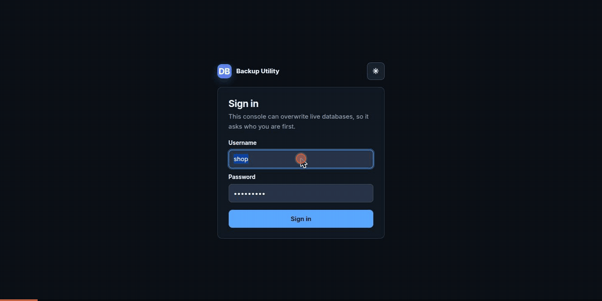

The console has a single operator account. Its name comes from
`OPERATOR_USERNAME` (default `admin`), and its password is stored only as a
bcrypt hash in `OPERATOR_PASSWORD_HASH`. Without that hash the application
refuses to start. A wrong password gets one generic message and never reveals
whether the user name exists.

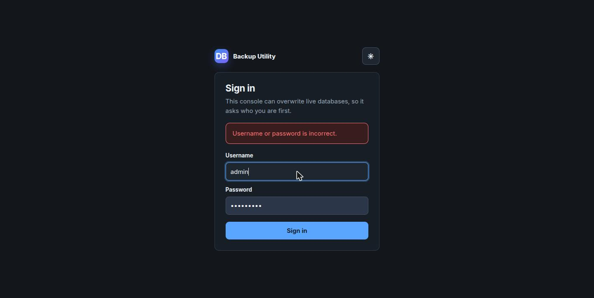

Every form carries a CSRF token. An idle session signs out after
`SESSION_TIMEOUT` (30 minutes by default). Database credential fields use a
separate browser form identity, so the browser does not offer database
passwords on this page. See
[ADR-011](adr/011-one-operator-account-from-the-environment.md) and
[ADR-037](adr/037-console-layout-and-credential-autofill.md).

## 2. Backup targets

A **target** is one database the tool can back up and restore into.
**Targets → Add target** asks for a name, the engine and its connection
details. The form changes with the engine:

- MongoDB adds an authentication database.
- Oracle adds the Data Pump directory object.
- SQLite asks only for a file path relative to `SQLITE_ROOT`.

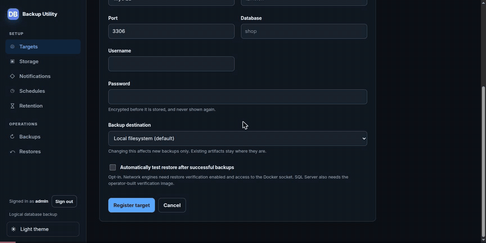

Validation reports every missing field at once:

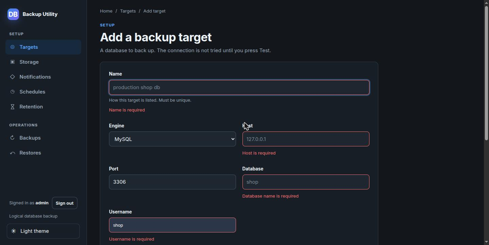

**Test** connects with the engine's own client and stores the result. A
failure shows the server's own message, which usually says exactly what is
wrong. Below, a target whose password was rotated elsewhere is rejected by
MySQL while the others connect:

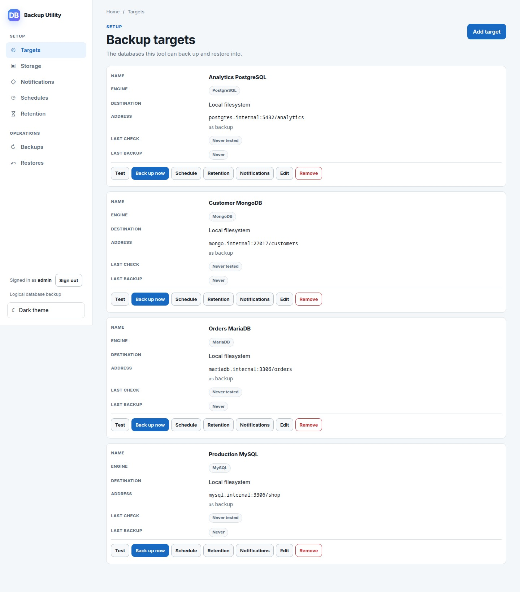

Targets and Storage choose between labelled cards and a table from their own
available width, not the viewport width. Below 1540px the cards wrap every
action without a horizontal scrollbar; a wider container uses the table
([ADR-038](adr/038-wide-tables-query-their-container.md)).

For PostgreSQL, **Test** also checks that `pg_dump` is not older than the
server ([ADR-035](adr/035-postgresql-17-client-and-version-preflight.md)).
For Oracle it checks that both the application and the database server can
read and write the shared Data Pump directory
([ADR-034](adr/034-oracle-pack-runtime-and-shared-staging-permissions.md)).

**Editing a target.** Name, host, port, user, password and storage
destination can change. A rotated password is an edit, not a new target. The
engine and database are fixed once registered, because a different database is
a different target. Leaving the password empty keeps the stored one. See
[ADR-012](adr/012-editing-a-target-keeps-its-schema.md).

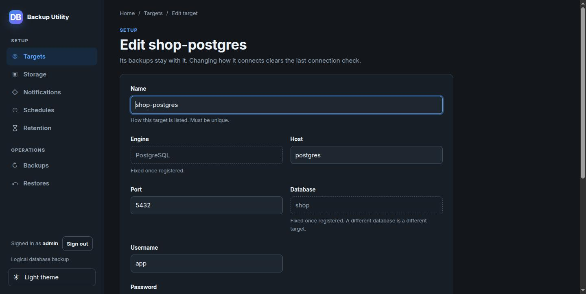

**Removing a target** takes its backups, their artifacts and the records of
restores into it along with it. The confirmation page counts what goes and asks
for the target's name:

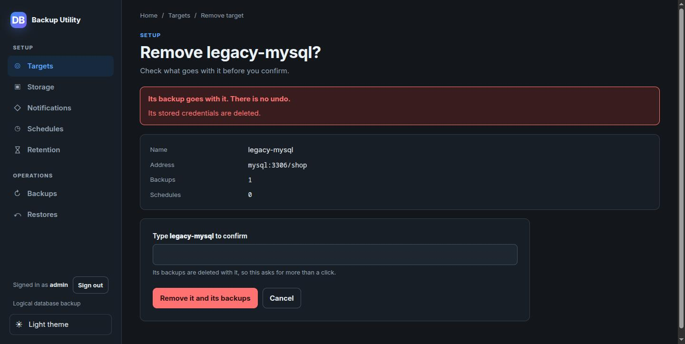

A target that still has a schedule cannot be removed until the schedule is
deleted, so nothing keeps firing at a database that no longer exists:

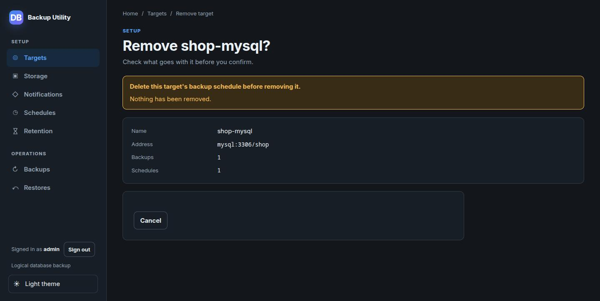

Below 1400 px the wide targets and storage tables turn into labelled cards,
so every action stays reachable on a laptop:

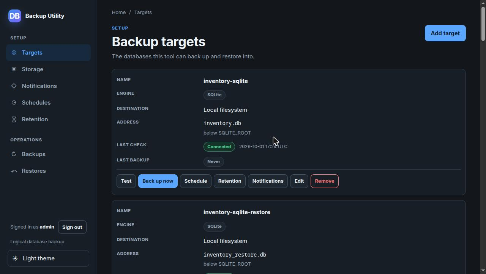

All passwords, keys and tokens are encrypted with AES-256-GCM under
`ENCRYPTION_SECRET_KEY` and are never shown again
([ADR-002](adr/002-aes-256-gcm-for-target-passwords.md)).

## 3. Running a backup

**Back up now** starts a full logical dump in the background and opens the
backup's page. While the job runs, the page follows it and updates itself when
it finishes. After a successful backup, a target can also start a restore
verification automatically; here the verification succeeded a few seconds
after the dump.

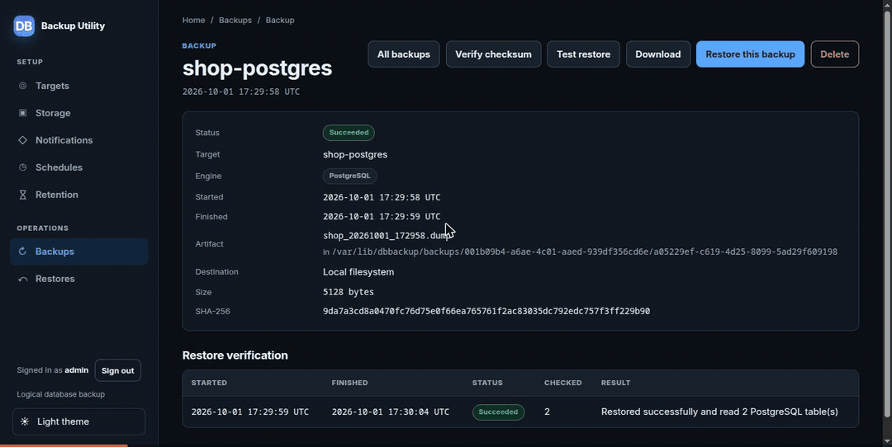

The detail page records:

- **Status, start and finish time.**
- **Artifact name and location.** On the local filesystem every backup gets a
  directory of its own, `<target-id>/<execution-id>/`, so two backups can never
  share a file ([ADR-033](adr/033-local-artifacts-live-per-target-and-execution.md)).
- **Destination, size and SHA-256.** The checksum is the value `sha256sum`
  prints for the downloaded file.

**Verify checksum** re-reads the stored artifact and compares it with the
recorded SHA-256. Backups made before 0.2.0 show "Not recorded"
([ADR-013](adr/013-a-checksum-for-every-artifact.md)):

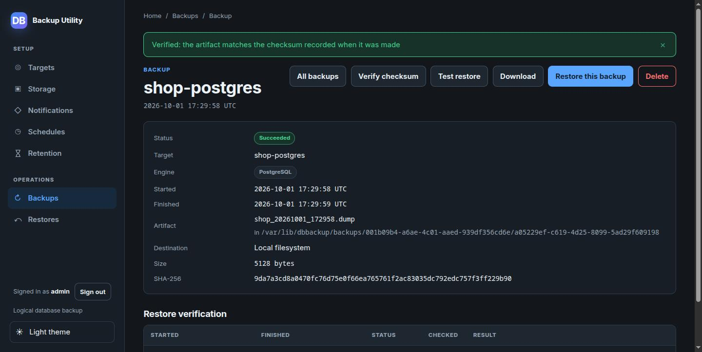

**Download** sends the artifact to the browser. It is the engine's normal
format, so `pg_restore --list`, `gunzip`, `mongorestore` and similar tools can
read it directly.

A failed backup keeps the client's error output under **Why it failed**:

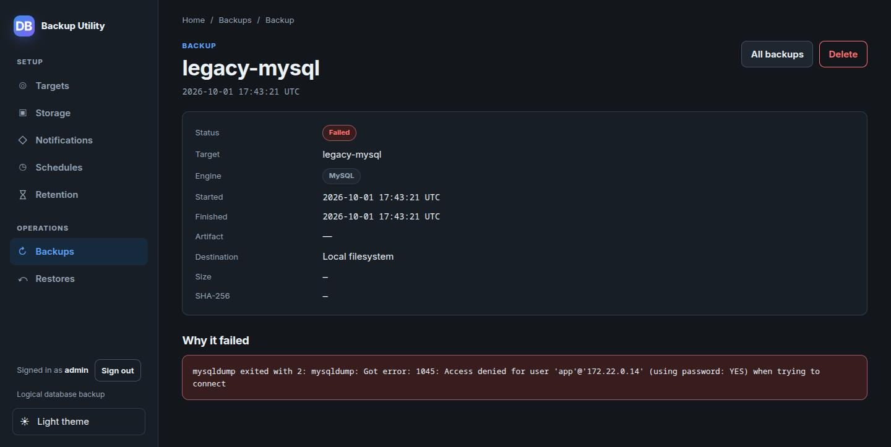

At most `JOB_CONCURRENCY` backups and restores run together (2 by default).
Up to `JOB_QUEUE_CAPACITY` more wait (20 by default); beyond that a job is
refused and recorded as failed. Dumps longer than `BACKUP_TIMEOUT` and
restores longer than `RESTORE_TIMEOUT` are stopped.

## 4. Backup history

**Backups** lists every backup, newest first, fifty per page, for all
destinations. The run below holds one backup of each engine:

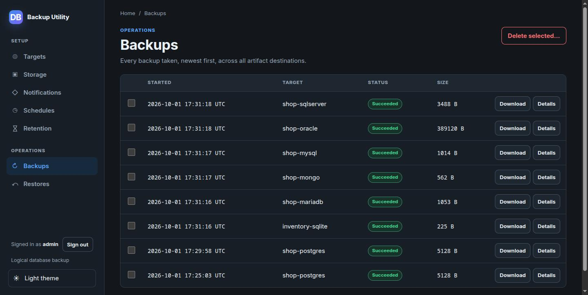

Several backups can be ticked and deleted together. The confirmation page
shows the artifacts, their total size and the restore records that go with
them ([ADR-008](adr/008-deleting-a-backup-takes-its-history-with-it.md),
[ADR-015](adr/015-deleting-many-backups-and-a-target-with-them.md)):

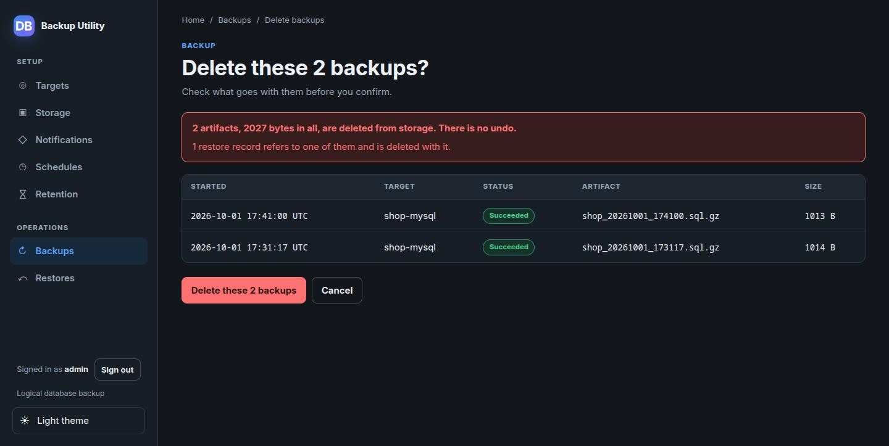

The target list shows each target's newest good backup and flags a newer
attempt that failed.

## 5. Restoring

**Restore this backup** opens a confirmation page.

- **Destination.** By default the restore goes back into the target the
  backup came from. Any other registered target of the same engine can be
  chosen instead, so a restore drill can go into a scratch database and leave
  production alone ([ADR-014](adr/014-restore-into-any-registered-target.md)).
- **What happens.** The page explains exactly what the restore does to the
  destination.
- **Confirmation.** You type the destination's name before anything runs
  ([ADR-007](adr/007-restore-applies-a-dump-and-asks-first.md)).

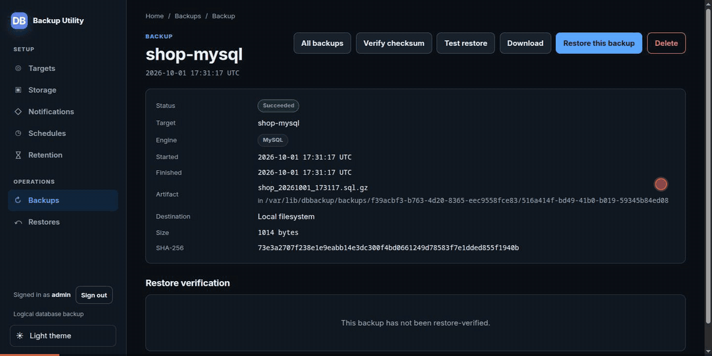

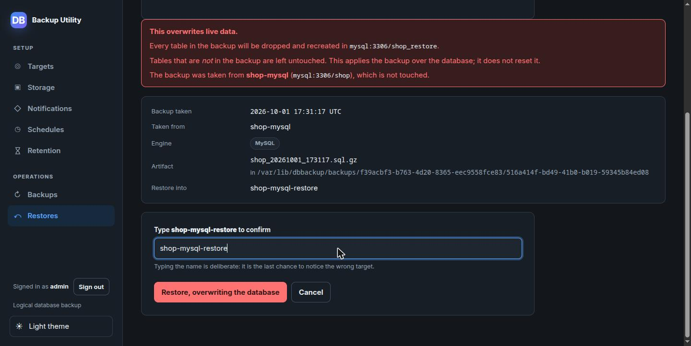

Before any engine receives the artifact, its SHA-256 is checked; an artifact
that has changed in storage is not applied. The restore then streams into the
engine's own client
([ADR-016](adr/016-restore-streams-the-dump-into-the-client.md)), and its
page follows it like a backup's:

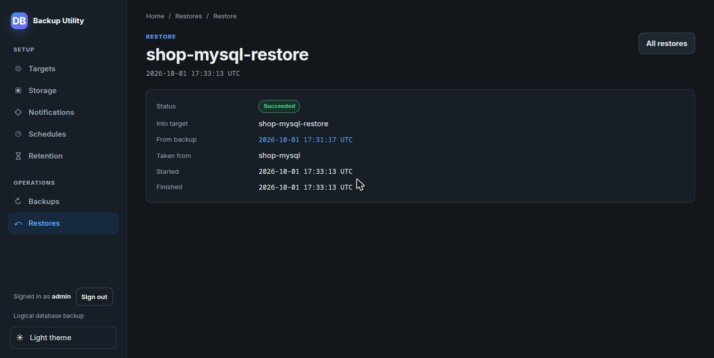

**Restores** lists every restore, with its source backup and destination. In
the tour every engine restored into a second database of the same engine:

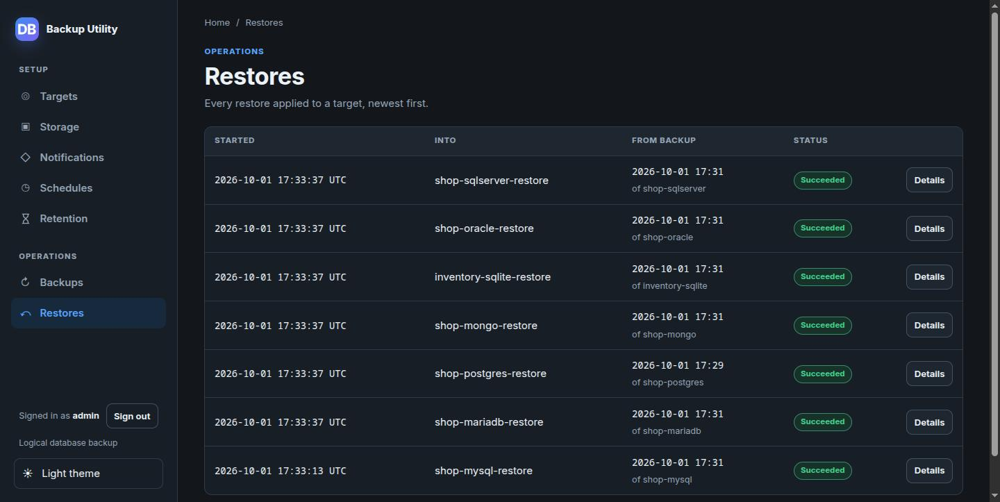

Restore semantics differ by engine; see [At a glance](#at-a-glance). The two
strictest cases:

- **SQL Server.** SqlPackage only imports into a database that is missing or
  has no user objects, so the tool refuses a non-empty destination rather than
  clearing it ([ADR-022](adr/022-sql-server-bacpac-and-optional-client-pack.md)).
- **SQLite.** The tool replaces the whole destination file, but only after the
  rebuilt copy passes validation.

## 6. Restore verification

A backup is only as good as its restore. **Test restore** proves the restore
without touching any registered database:

1. Starts a disposable database of the same engine in Docker.
2. Restores the artifact into it.
3. Runs the engine's health check (see [At a glance](#at-a-glance)).
4. Removes the disposable database again.

The attempt succeeds only once cleanup has finished. The disposable database
publishes no ports and never receives the source database's credentials.

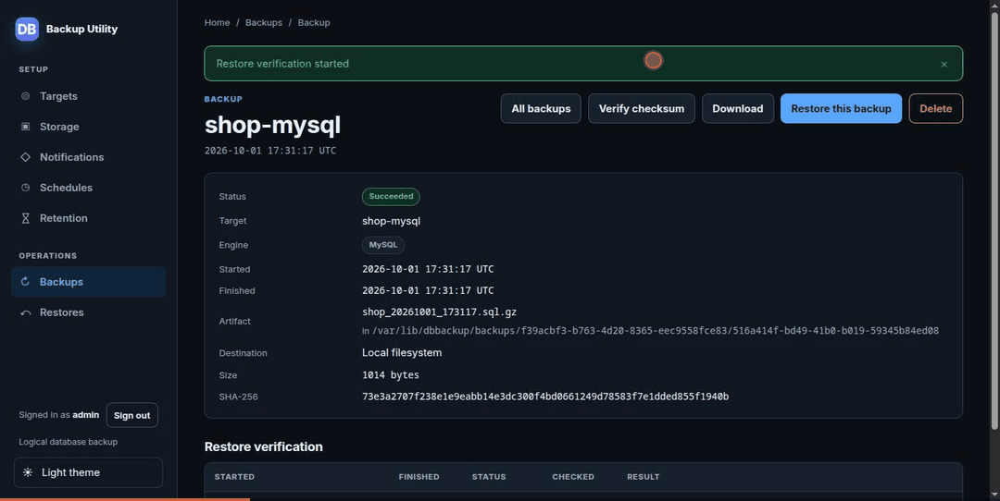

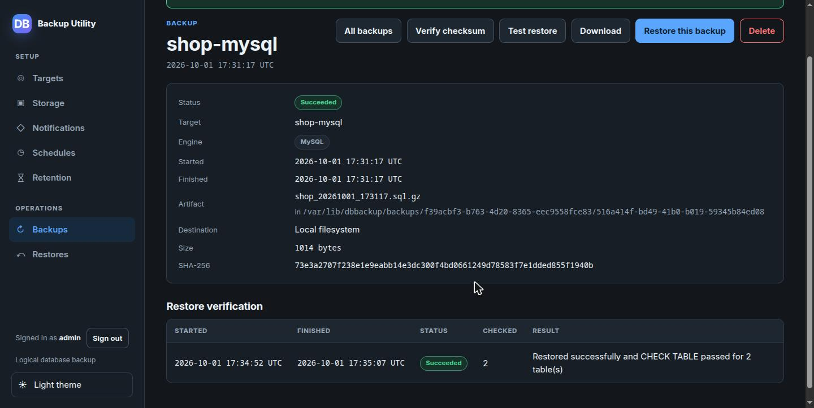

Ticking **Automatically test restore after successful backups** on a target
runs the same check after every successful backup. The tour verified all seven
engines; Oracle uses Oracle Free and SQL Server an operator-built image that
contains SqlPackage:

| Oracle | SQL Server |
| --- | --- |
| 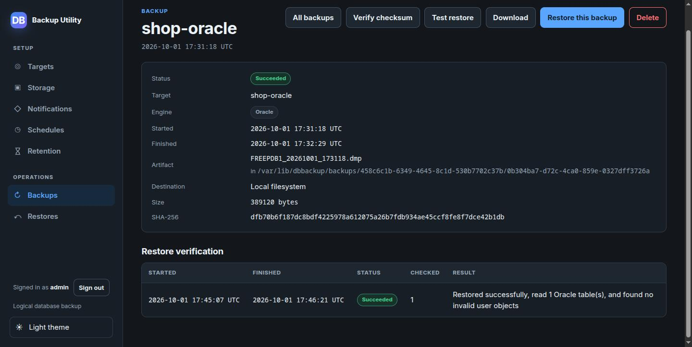 |  |

Verification is off by default. Turn it on with
`DBBACKUP_VERIFICATION_ENABLED=true`. Network engines also need the Docker
socket mounted into the application container, which is root-equivalent
access to the Docker host; [deployment](deployment.md) explains how, including
the extra setting needed on SELinux hosts. SQLite verification needs no
Docker. See [ADR-029](adr/029-isolated-restore-verification.md) and
[ADR-030](adr/030-oracle-and-sql-server-restore-verification.md).

## 7. Storage destinations

The built-in local filesystem (`BACKUP_DIR`) is always available and is the
default. **Storage** adds remote destinations:

| Provider | Credentials | Notes |
| --- | --- | --- |
| S3-compatible | Static access key, or the AWS default credential chain | Custom endpoint and path-style access for MinIO, Ceph, S3Mock and similar |
| Google Cloud Storage | Application Default Credentials, or an encrypted service-account JSON key | Custom endpoint for emulators |
| Azure Blob Storage | Azure Default Credential, or an encrypted storage-account key | Container and blob prefix; custom endpoint for Azurite |

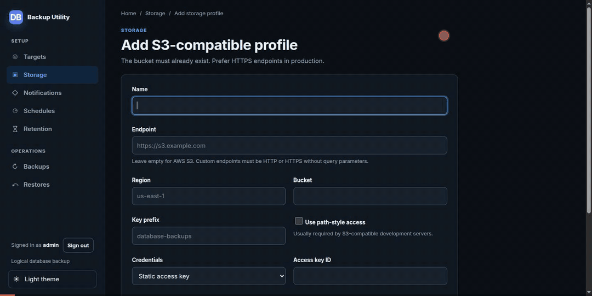

**Test** runs a create, metadata-read, content-read and delete probe against
the bucket or container. In the animation the first test fails, because a
development S3 server needs path-style access. After that option is turned on,
the test passes.

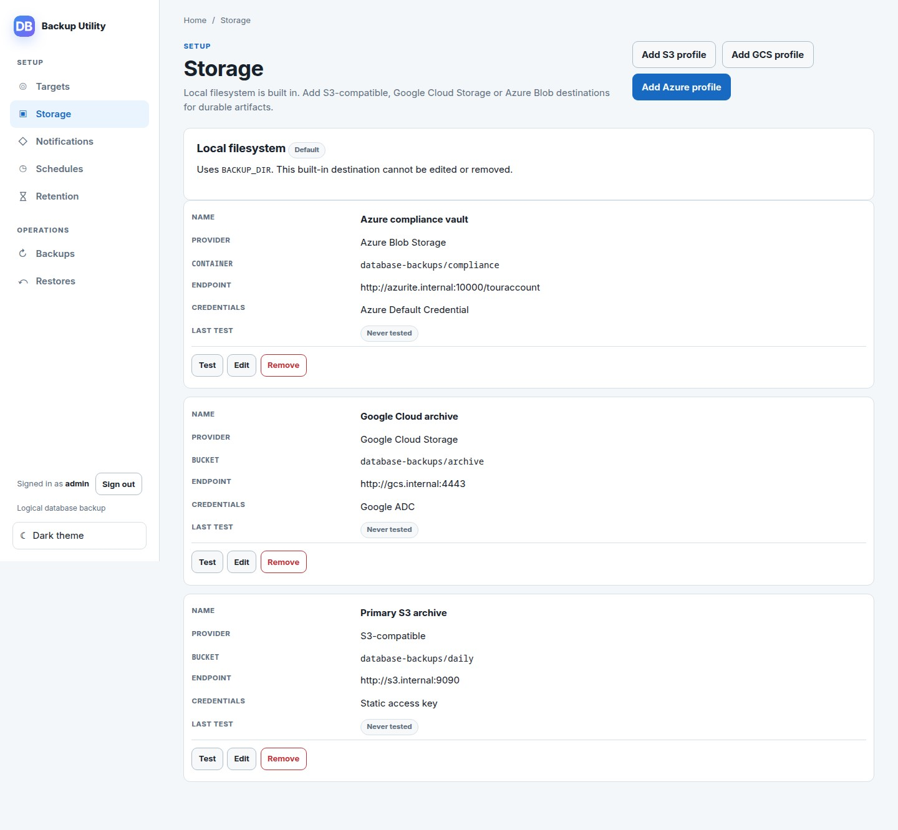

| S3 form | Azure form |
| --- | --- |
| 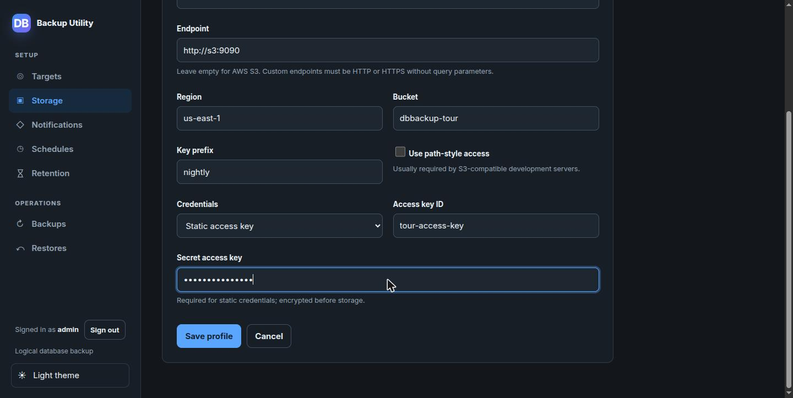 | 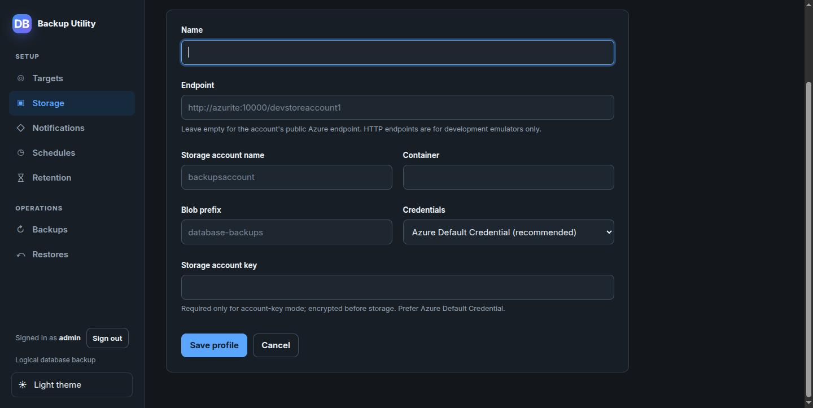 |

Each target picks one destination. Changing it affects new backups only:
existing backups keep their original location. A remote artifact is staged in
`STORAGE_STAGING_DIR` only while a dump, restore or verification needs it, and
the staging copy is removed afterwards. The object key mirrors the local
layout, `<prefix>/<target-id>/<execution-id>/<file>`:

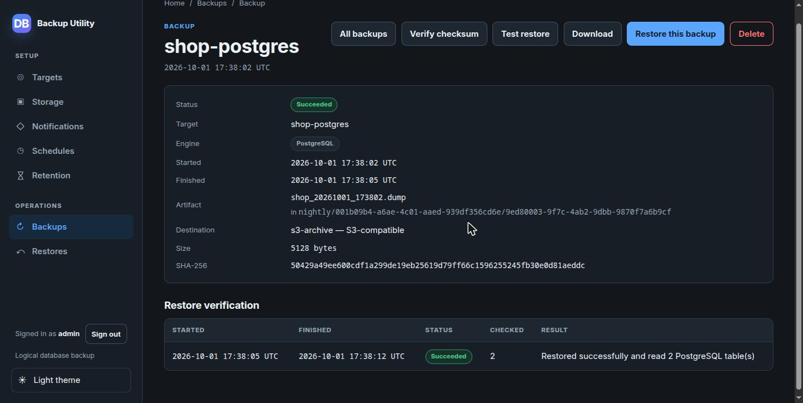

See [ADR-025](adr/025-s3-storage-profiles-and-local-staging.md),
[ADR-026](adr/026-google-cloud-storage-profiles.md) and
[ADR-027](adr/027-azure-blob-storage-profiles.md).

## 8. Schedules

A **schedule** runs the same full backup on a recurring Quartz cron
expression, in an explicit IANA time zone. Quartz cron has a seconds field
first: `0 30 2 * * ?` means 02:30:00 every day.

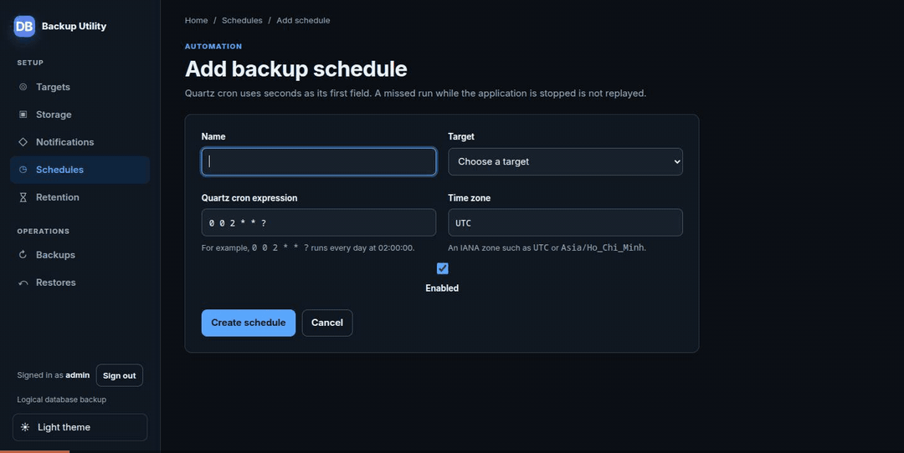

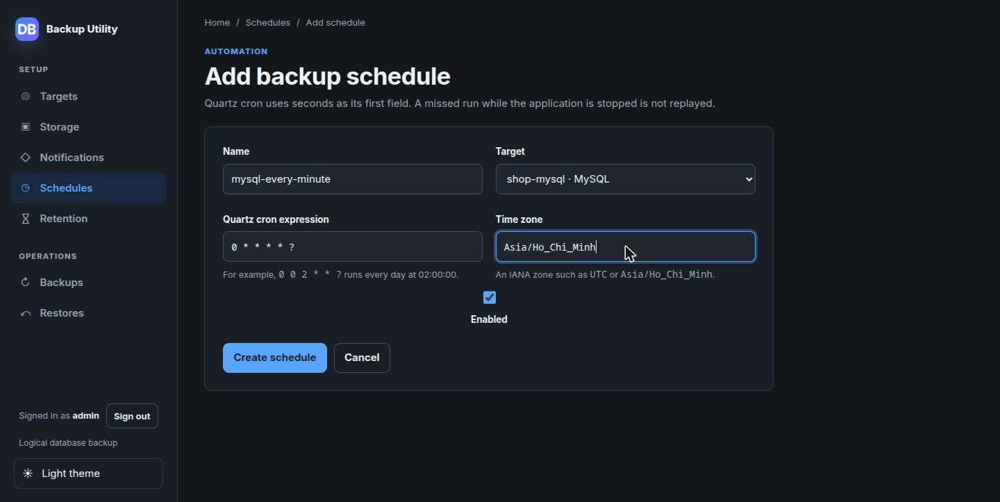

The list shows each schedule's next run in its own zone. A schedule can be
edited, paused and deleted:

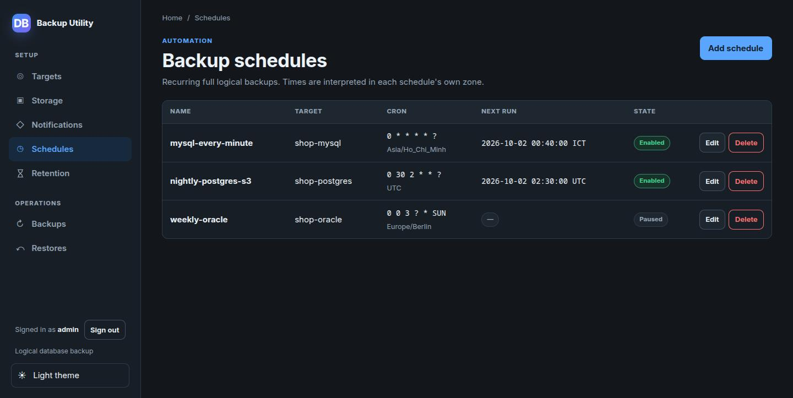

Schedules survive restarts. A run missed while the application was stopped is
not replayed. See
[ADR-023](adr/023-quartz-triggers-are-derived-from-backup-schedules.md).

## 9. Retention

Retention is optional and set per target: **Retention → Enable** and choose how
many successful backups to keep.

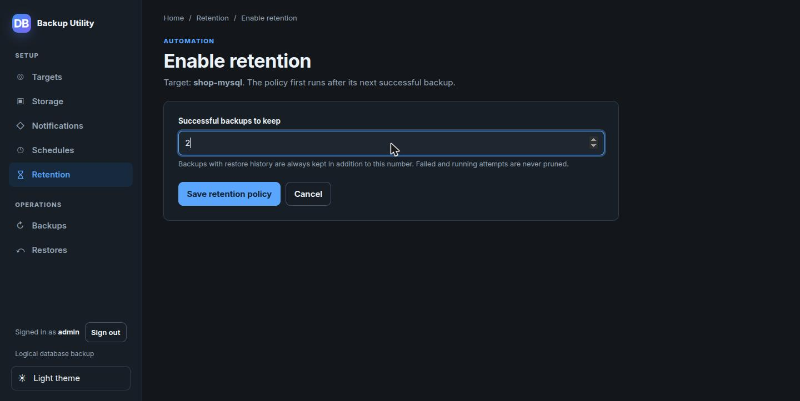

The policy runs after each successful backup of that target. It deletes
successful backups beyond the newest *N*, with three exceptions:

- A backup with any restore history is always kept, in addition to the *N*.
- Failed attempts are never pruned.
- Running attempts are never pruned.

The list shows the latest outcome. Below, `shop-mysql` keeps two copies and
the last run deleted one older backup. The backup that had been restored was
kept in addition to the two:

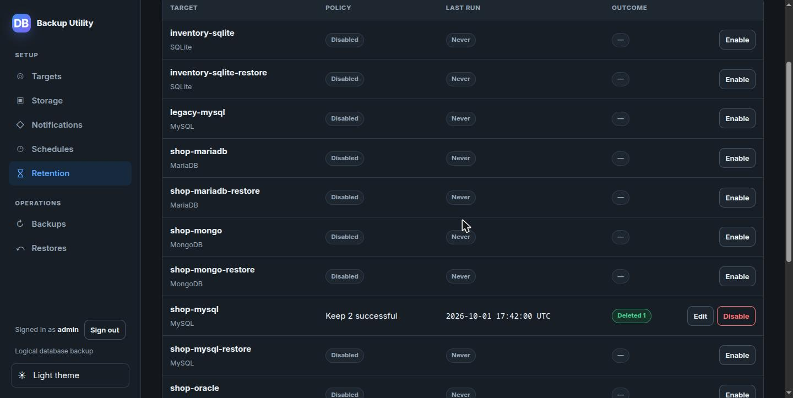

See [ADR-024](adr/024-retention-keeps-new-unrestored-backups-per-target.md).

## 10. Notifications

**Notifications** holds reusable channels: Telegram, Slack, Email and generic
Webhook. Each target then chooses which channels hear about which events:

- backup started, succeeded or failed;
- restore started, succeeded or failed;
- verification succeeded or failed.

A new subscription starts with the three failure events ticked. Restore events
follow the *destination* target and name both source and destination.

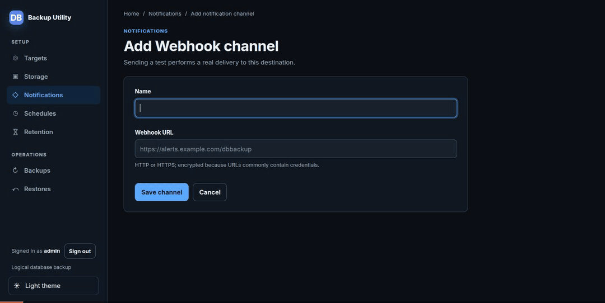

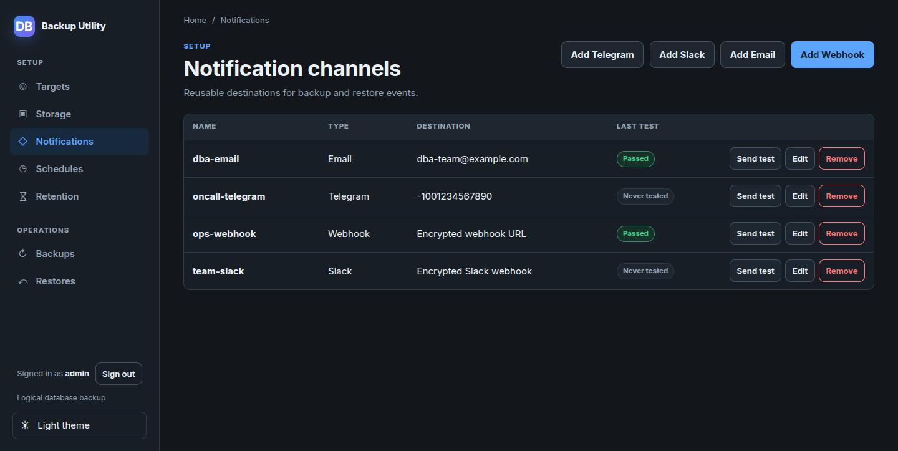

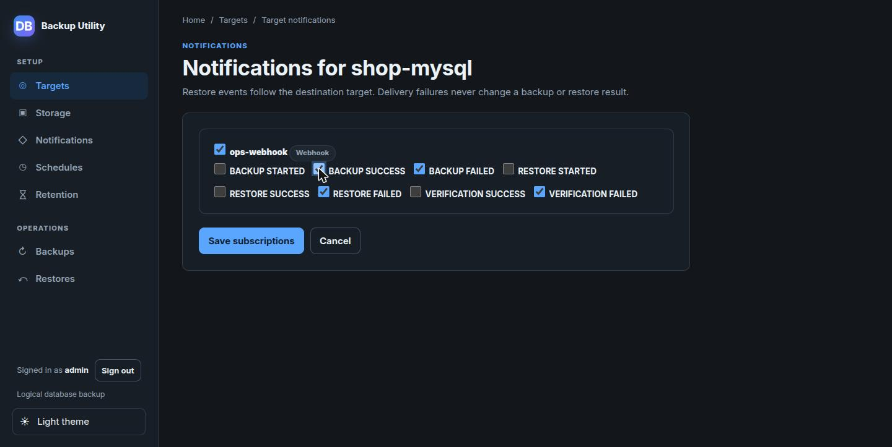

**Send test** performs a real delivery. Telegram bot tokens, Slack webhook URLs
and webhook URLs are encrypted and never displayed again; Slack accepts only
the official HTTPS incoming-webhook hosts. Email uses deployment-wide SMTP
settings (`DBBACKUP_SMTP_*`) and stays disabled until a host is configured.

| Generic webhook delivery | Email (here caught by Mailpit) |
| --- | --- |
| 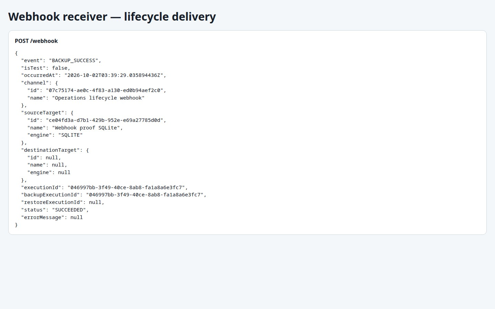 | 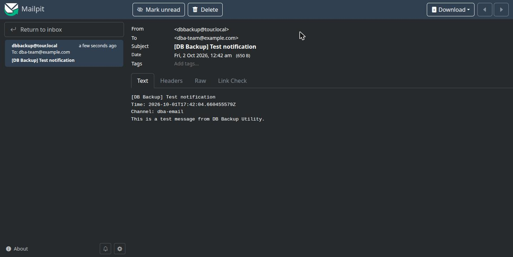 |

The generic webhook body is stable JSON. It contains the event, `isTest`, an
ISO-8601 `occurredAt`, the receiving channel's id and name, source and
destination targets, the execution ids, status and a sanitized error message.

Delivery is best effort with short timeouts. A notification failure is logged
and never changes the result of a backup or restore. See
[ADR-028](adr/028-target-scoped-notification-channels.md).

## 11. HTTP API and CLI

Everything the console does is also available through the versioned
`/api/v1` HTTP API, using HTTP Basic with the same operator account. The
bundled `dbbackup` CLI is a stateless client of that API. Neither has a
scheduler or worker of its own; both call the same application services as
the console ([ADR-031](adr/031-cli-over-the-operator-http-api.md)).

Commands follow `dbbackup <group> <action>`:

- **Output.** Text output prints tables for lists and key/value sections for
  details. `--output json` prints the full response envelope for scripts.
- **Waiting.** Backup, restore and test-restore wait for a final result by
  default and exit with code `5` if the job failed. `--no-wait` returns as
  soon as the job is accepted.

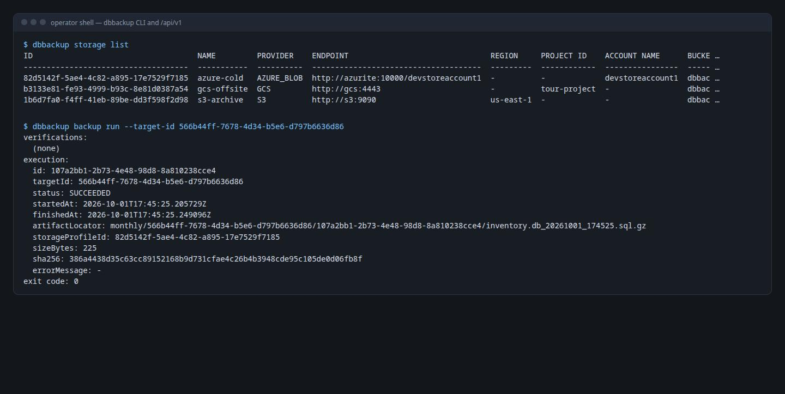

Validation errors list every field problem in request order, keeping the first
one in `message`/`field` for older clients
([ADR-036](adr/036-stable-operator-contracts.md)):

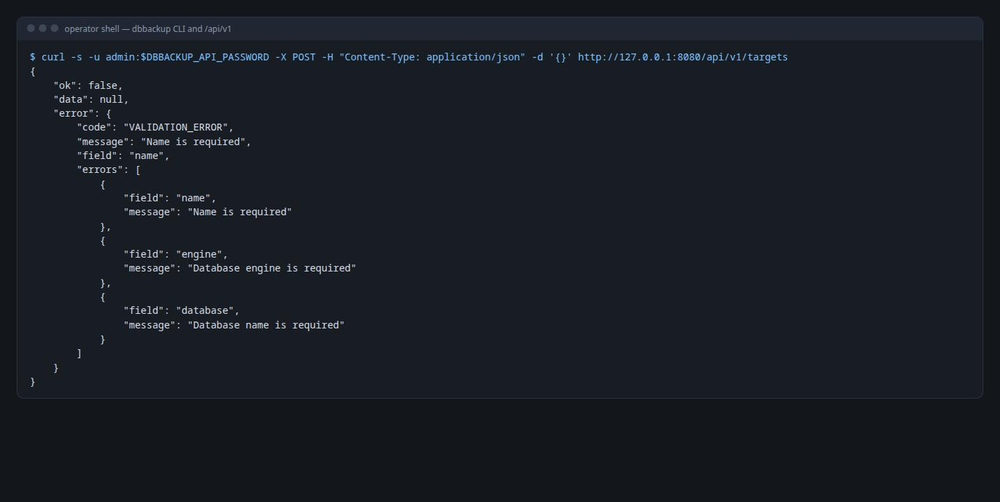

The CLI handles secrets carefully:

- **Operator password.** It comes from `DBBACKUP_API_PASSWORD`,
  `--password-file` or `--password-stdin`, never from argv.
- **Resource credentials.** Database, storage and channel credentials are
  bound from environment variables with `--secret FIELD=ENV_VAR`.
- **Transport.** Plain HTTP is refused for anything but loopback unless
  `--allow-http` is given.

The full resource list is in the [HTTP API reference](http-api.md).

## 12. Console conveniences

- **Light and dark themes.** The button at the bottom of the sidebar switches
  between them; the choice is remembered in the browser.
- **Live detail pages.** Backup, restore and verification pages follow a
  running job and update when it finishes. They pause while the tab is hidden
  ([ADR-010](adr/010-the-detail-page-follows-a-running-job.md)).
- **Breadcrumbs and flash messages** on every page.
- **Laptop layout.** Wide tables become cards and crowded page headers stack.

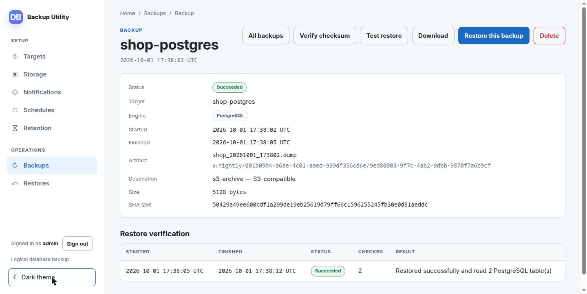

## Security model

- **One operator account.** The password exists only as a bcrypt hash, and
  every console form carries a CSRF token.
- **Encrypted secrets.** Database passwords, storage keys and notification
  tokens are encrypted with AES-256-GCM, written once and never rendered back.
- **Losing the key.** Without `ENCRYPTION_SECRET_KEY` the stored secrets
  cannot be recovered; keep it safe.
- **Integrity.** Every artifact has a SHA-256 that is checked before every
  restore.
- **Sanitized notifications.** Known password, token, authorization and
  credential shapes are redacted from an execution error before it reaches
  any notification channel.
- **Verification is opt-in.** It needs the Docker socket, which grants
  root-equivalent control of the host.
- **The API is administrative.** Put TLS in front of it and firewall it like
  the console.
- **Releases.** Published releases carry SBOMs, checksums and GitHub artifact
  attestations; see [SECURITY.md](../SECURITY.md).

## Limits and non-goals

- **No physical, incremental or point-in-time backups.** There is no binlog,
  WAL or oplog replay; every backup is a full logical dump.
- **No cross-engine restore.** A MySQL backup restores into MySQL only.
- **Missed scheduled runs are not replayed** after downtime.
- **Oracle and SQL Server need optional client packs.** The base image does
  not contain them. Oracle needs operator-supplied Instant Client files
  ([ADR-020](adr/020-oracle-data-pump-shared-staging-and-optional-client-pack.md)).
  SQL Server uses SqlPackage BACPAC, which suits databases below roughly
  200 GB ([ADR-022](adr/022-sql-server-bacpac-and-optional-client-pack.md)).
- **Walkthrough findings.** Issues found by the recorded walkthroughs and the
  slices that fixed them are tracked in
  [walkthrough/ISSUES.md](walkthrough/ISSUES.md).

## How this tour was recorded

The tour ran on 2026-10-02 against `develop` at `5282738` (0.20.0-SNAPSHOT),
in a throwaway Docker Compose project. It contained:

- **Application.** The base image with both optional packs layered on top
  (SqlPackage and Oracle Instant Client 23.26), restore verification enabled,
  and SMTP pointed at Mailpit.
- **Databases.** MySQL 8.4, MariaDB 10.11, PostgreSQL 17, MongoDB 8.0, Oracle
  Free 23 and SQL Server 2022 sources, each seeded with a small `shop` schema
  and a second, empty database used as the restore destination. A SQLite file
  sat below `SQLITE_ROOT`.
- **Emulators and helpers.** Adobe S3Mock, fake-gcs-server and Azurite as
  storage; Mailpit for email; a small HTTP receiver for webhooks, which also
  served the fake GCS token endpoint.

Every flow was driven in Chrome through the real console. Bulk setup (the
other thirteen targets, two of the storage profiles) was submitted through the
same forms with the page's own CSRF token. Slack and Telegram channels were
created but not test-sent, because that would contact the real services. All
credentials in the images belong to the throwaway environment.

The tour found three problems, all fixed in slices 37–39 and recorded as
[ISSUE-15 to ISSUE-17](walkthrough/ISSUES.md#issue-15). One of them is the
build fix that the Oracle pack needed for this recording.
